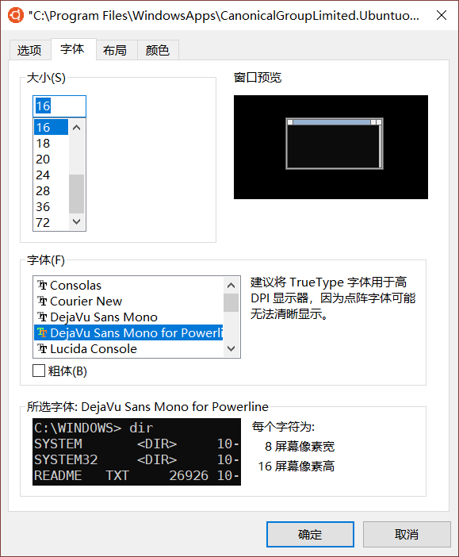

# Ubuntu on Windows 10        
[参考文档](https://docs.microsoft.com/zh-cn/windows/wsl/install-win10)            

### Windows 10 系统安装 DejaVu Sans Mono for Powerline 字体          
安装 zsh 后，设置 agnoster 主题，一直乱码，各种安装 powerline 字体，都无法解决，最后在 windows 系统下安装字体完美解决。         
[DejaVu Sans Mono for Powerline](https://gitee.com/koomox/powerline-fonts/tree/master/DejaVuSansMono) 字体下载      
            