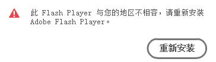

# Adobe            
### Adobe CC 2017 离线独立安装包           
Download Creative Cloud apps: [https://helpx.adobe.com/creative-cloud/kb/creative-cloud-apps-download.html](https://helpx.adobe.com/creative-cloud/kb/creative-cloud-apps-download.html)            
### Creative Cloud           
Creative Cloud 云下载: [https://ccmdls.adobe.com/AdobeProducts/KCCC/1/win32/CreativeCloudSet-Up.exe](https://ccmdls.adobe.com/AdobeProducts/KCCC/1/win32/CreativeCloudSet-Up.exe)            
### Adobe Flash Player 插件下载              
百度云盘链接：[https://yun.baidu.com/s/1n4XMEXf0tvJySdtmfwIp8A](https://yun.baidu.com/s/1n4XMEXf0tvJySdtmfwIp8A)  密码: `4vtk`              
Yandex 网盘链接: [https://yadi.sk/d/S3aGTgqU3RVUyC](https://yadi.sk/d/S3aGTgqU3RVUyC)            
### CentOS 系统自动下载 Flash Playre 脚本              
运行脚本后，需要输入版本号，可以通过 [https://flash.2144.com/](https://flash.2144.com/) 网站查看。              
```sh
curl -LO https://gitee.com/koomox/devops/raw/master/storage/linux/scripts/adobe/flash.sh
chmod +x ./flash.sh
./flash.sh
```
### 地区限制           
打开乐视视频播放电影的时候，出现下面的提示。              
                
Windows 系统的 hosts 文件路径              
```
C:\Windows\System32\drivers\etc
```
把如下内容添加到 hosts 文件            
```
127.0.0.1 www.2144.cn
127.0.0.1 flash.2144.cn
127.0.0.1 www.flash.cn
127.0.0.1 fpdownload.macromedia.com
```