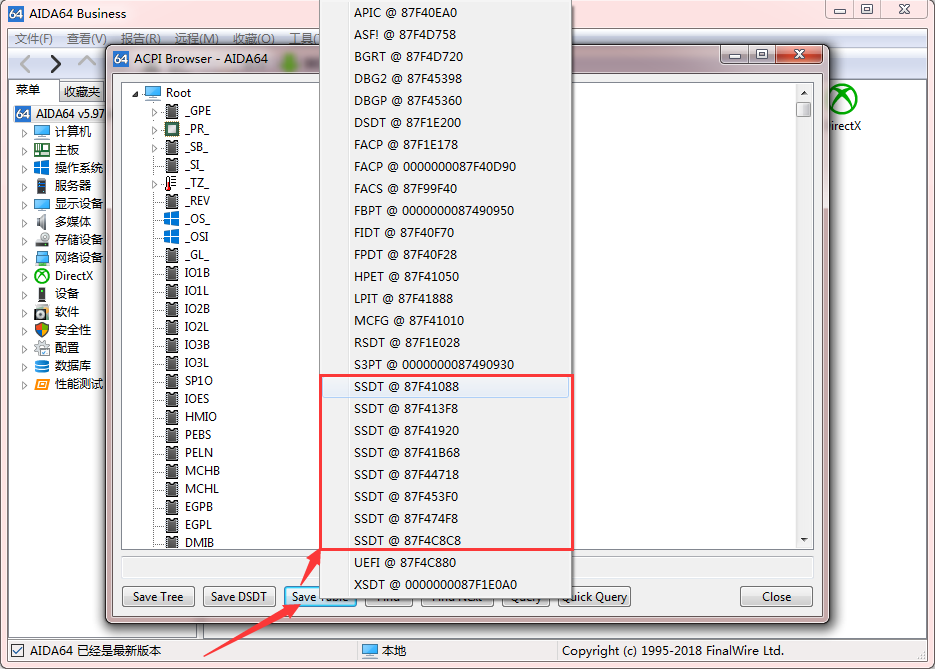

# DSDT                   
### AIDA64 提取 DSDT           
AIDA64 Business 商业版: [下载地址](aida64.md)            
打开 AIDA64，点击 <i class="code">工具</i>，选择 <i class="code">ACPI 浏览器</i>。          
            
提取 DSDT 保存，后缀名 <i class="code">.aml</i>。              
            
这里有多个 SSDT 需要把每一个都提取出来，后缀名 <i class="code">.aml</i>。 依次保存为 <i class="code">SSDT-1.aml</i>、 <i class="code">SSDT-2.aml</i>、 <i class="code">SSDT-3.aml</i>...                
            