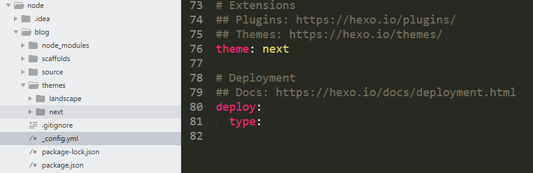

# Hexo + github 搭建个人博客            
git 官网: [传送门](https://git-scm.com/downloads)         
Node 8.x: [传送门](https://nodejs.org/dist/latest-v8.x/)        
Hexo 官网: [传送门](https://hexo.io/zh-cn/)          
Next 主题: [传送门](http://theme-next.iissnan.com/getting-started.html)                
Next 主题: [下载地址](https://github.com/iissnan/hexo-theme-next/releases)        
### 安装 git         
安装好 git 后，设置用户信息。               
```
git config --global user.name "github.user"
git config --global user.email "github.email"
git config --global http.postBuffer 524288000    # git 文件上传大小默认为1M，如果超过1M就无法上传，500M
git config --global --list
```
### 安装 Node 8.x            
将 Node 8.x 二进制包解压到 `D:\usr\local\node\` 路径下，设置环境变量。           
<table>
	<tr>
		<td>变量名</td><td>变量值</td>
	</tr>
	<tr>
		<td>NODE_HOME</td><td>D:\usr\local\node\node-v8.12.0-win-x64</td>
	</tr>
	<tr>
		<td>PATH</td><td>%NODE_HOME%</td>
	</tr>
	<tr>
		<td>NODE_PATH</td><td>%NODE_HOME%\node_modules</td>
	</tr>
</table>                       
              
使用如下命令，查看 `node`、`npm` 版本信息。          
```
node -v
npm -v
```
### 安装 Hexo        
安装 Hexo 之前，必须已经安装设置好 git、Node 环境，Windows 环境下打开 `git bash`，使用如下命令安装 Hexo。           
```bash
npm install hexo-cli -g
```
创建 Hexo 项目，`D:\code\node\blog` 进入 `blog` 项目路径下，Windows 环境下打开 `git bash`，使用如下命令初始化 Hexo 项目，将生成许多文件。（也可以进入`D:\code\node` 路径下，使用 `hexo init blog` 创建并初始化hexo项目）         
```bash
hexo init
```
进入项目路径 `D:\code\node\blog`，安装 npm 依赖        
```
npm install
```
如下命令生成 Hexo 项目静态文件，命令选项 `-d, --deploy` 文件生成后立即部署网站，`-w, --watch` 监视文件变动。          
```
hexo generate
```
启动本地服务器。 默认情况下，访问网址为 `http://localhost:4000`。 命令选项 `-p, --port` 重设端口，`-s, --static` 只使用静态文件，`-l, --log` 启动日志记录 ，使用覆盖记录格式。                        
```
hexo server
```
部署网站。 命令选项 `-g, --generate` 部署之前预先生成静态文件。            
```
hexo deploy
```
清除缓存文件 `db.json` 和已生成的静态文件 `public`。在某些情况下（尤其是更换主题后），如果发现您对站点的更改无论如何也不生效，您可能需要运行该命令。           
```
hexo clean
```
### 安装 Next 主题        
Next 主题: [下载地址](https://github.com/iissnan/hexo-theme-next/releases)          
将其 Next 主题压缩包，解压到 Hexo 项目的 `themes` 路径下，并重命名为 `next` 文件夹。        
打开 Hexo 项目下的 `_config.yml` 文件，修改主题为 `next`。        
         