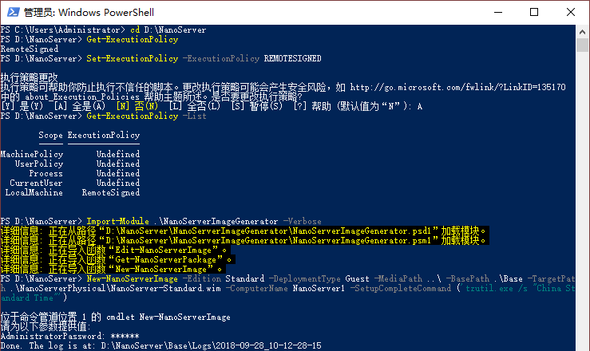
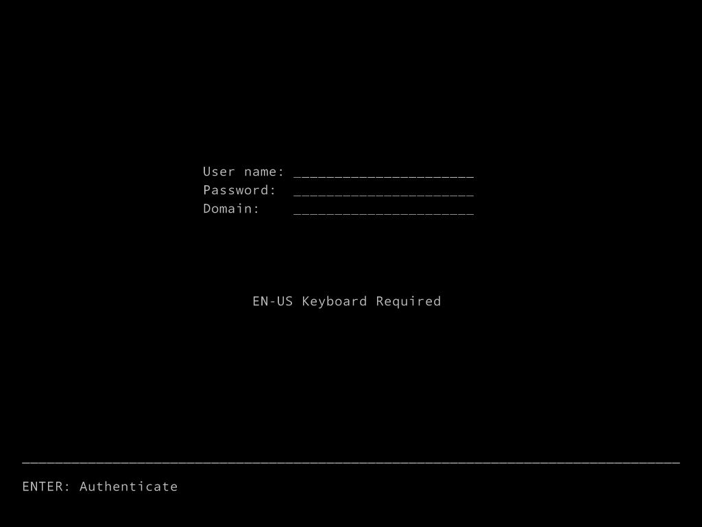
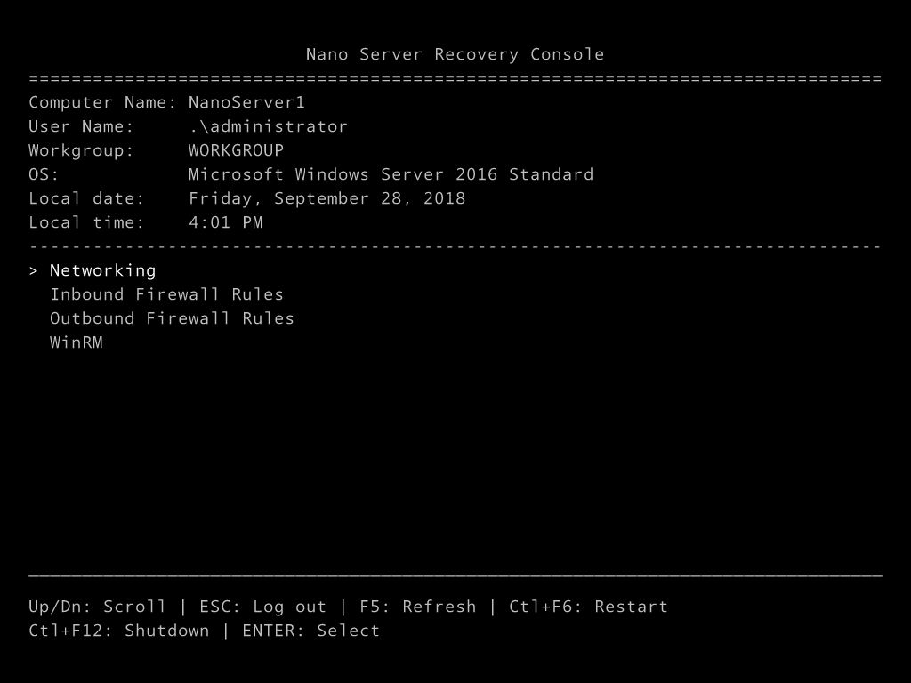
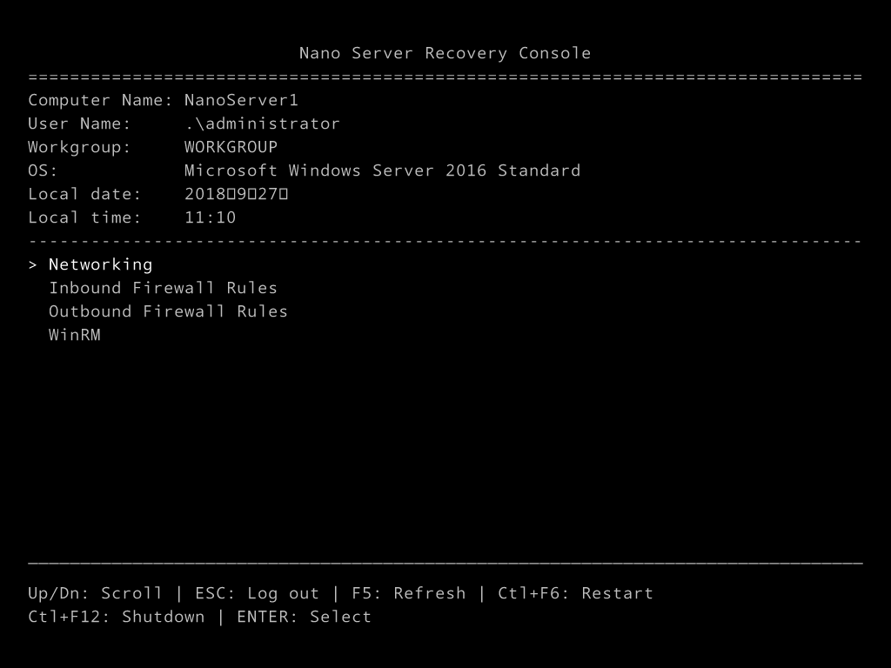

# 部署 Nano Server         
参考文档: [传送门](https://docs.microsoft.com/zh-cn/windows-server/get-started/deploy-nano-server)               

一、从 Windows Server 2016 英文版 ISO 中将 \NanoServer 文件夹复制到计算机上的本地文件夹(如D盘根目录)。            

> NanoServer 文件夹      
>> NanoServer.wim 微软提供的服务器映像文件。        
>> Packages 可以加载到 NanoServer 的功能包     
>> \NanoServerImageGenerator\Convert-WindowsImage 用来将WIM文件转换为VHD(VHDX)的程序。        
>> \NanoServerImageGenerator\NanoServerImageGenerator 用来生成 NanoServer 服务器映像的程序。        

二、以管理员身份启动 Windows PowerShell，将目录更改为 NanoServerImageGenerator 文件夹所在的文件夹，然后使用 `Import-Module .\NanoServerImageGenerator -Verbose` 导入模块。             

> 可能必须调整 Windows PowerShell 执行策略。 `Set-ExecutionPolicy RemoteSigned` 应能正常工作。     
>> 1、`cd D:\NanoServer` 进入 NanoServerImageGenerator 文件夹所在目录。          
>> 2、`Get-ExecutionPolicy` 查询PowerShell当前策略设置。     
>> 3、`Set-ExecutionPolicy -ExecutionPolicy REMOTESIGNED` 查询结果为 Restricted 受限制的，我们需要修改安全策略，并输入 `A`。         
>> 4、 `Get-ExecutionPolicy -List` 查看修改结果。            

           

若要创建 Nano Server 映像以用作 Hyper-V 主机，请运行以下命令：         
```bat
New-NanoServerImage -Edition Standard -DeploymentType Host -MediaPath <path to root of media> -BasePath .\Base -TargetPath .\NanoServerPhysical\NanoServer.wim -ComputerName <computer name> -OEMDrivers -Compute -Clustering
```
* -Edition 指定系统版本，Standard 标准版，Datacenter 数据中心版。          
* -DeploymentType 指定主机类型，Host 为物理主机，Guest 为虚拟机。       
* -MediaPath 是 \NanoServer 文件夹所在的路径。          
* -Basepath 将包含 Nano Server 二进制文件的副本，因此可使用 New-NanoServerImage -BasePath，且以后运行时无需指定 -MediaPath。           
* -TargetPath 将包含生成的 .wim 文件，该文件包含所选角色和功能。 请务必指定 .wim 扩展名。           
* -Compute 将添加 Hyper-V 角色。      
* -OemDrivers 将添加大量常见驱动程序。          

创建一个标准版的虚拟主机 Nano Server 映像。           
```bat
New-NanoServerImage -Edition Standard -DeploymentType Guest -MediaPath ..\ -BasePath .\Base -TargetPath .\NanoServerImage\NanoServer-Standard.wim -ComputerName NanoServer1 -SetupCompleteCommand ('tzutil.exe /s "China Standard Time"')
```
输入 Administrator 用户的密码，以后登录的时候需要使用。            

三、导入 VMware 驱动        
虚拟机中安装 Windows Server 2016，安装 VMware Tools。采用手动安装的方式，打开命令提示符使用如下命令安装        
```bat
D:\setup64.exe /a /q %userprofile%\Documents
```
指定安装文件夹，安装完成后，从安装目录下找到 Drivers 文件夹，拷贝到 \NanoServer\VMware_Tools_Extracted 目录下。            
挂载镜像         
```bat
cd D:\NanoServer
Dism /Mount-Image /ImageFile:.\NanoServerImage\NanoServer-Standard.wim /Index:1 /MountDir:.\Mount
```
添加 VMware 驱动到镜像               
```bat
Dism /Add-Driver /Image:.\Mount /Driver:".\VMware_Tools_Extracted\Drivers\pvscsi\Win8\pvscsi.inf"
Dism /Add-Driver /Image:.\Mount /Driver:".\VMware_Tools_Extracted\Drivers\vmci\device\Win8\vmci.inf"
Dism /Add-Driver /Image:.\Mount /Driver:".\VMware_Tools_Extracted\Drivers\vmxnet3\Win8\vmxnet3.inf"
```
添加 OEM 驱动到镜像       
```bat
Dism /Add-Package /PackagePath:.\Packages\Microsoft-NanoServer-OEM-Drivers-Package.cab /Image:.\Mount
```
提交并卸载镜像      
```bat
Dism /Unmount-Image /MountDir:.\Mount /Commit
```
如此，就得到了一个可以在 VMware 使用的 Nano Server 映像文件。           
### VMware 安装 Nano Server          
1、使用 Windows PE 启动虚拟机，使用下面的命令自动分区。        
```bat
diskpart /s CreatePartitions-UEFI.txt
```
```txt
Select disk 0
clean
Convert GPT
Create partition efi size=100
Format quick FS=FAT32 label="System"
Assign letter="S"
Create partition msr size=128
Create partition primary
Format quick FS=NTFS label="NanoServer"
Assign letter="N"
List volume
exit
```
2、安装 Dism 映像，添加引导。        
```bat
Dism /Apply-Image /Imagefile:.\NanoServer.wim /Index:1 /ApplyDir:N:\
bcdboot N:\Windows /S S:
```
### Nano Server        
Nano Server 启动完成后的界面。         
        
输入账号密码后，进入主界面，用户 Administrator，密码就是生成镜像的时候填写的。          
       
### Nano Server 乱码问题解决方案          
第一次使用中文版的 Windows Server 2016 中的 Nano Server 生成的映像，时间显示乱码。使用英文版的 Windows Server 2016 中的 Nano Server 生成映像即可。          
       