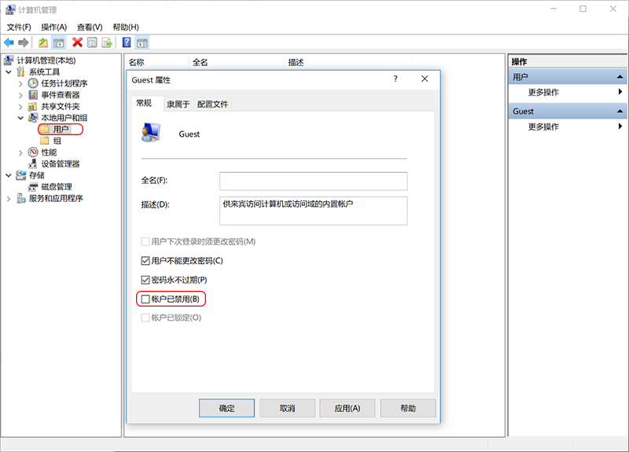
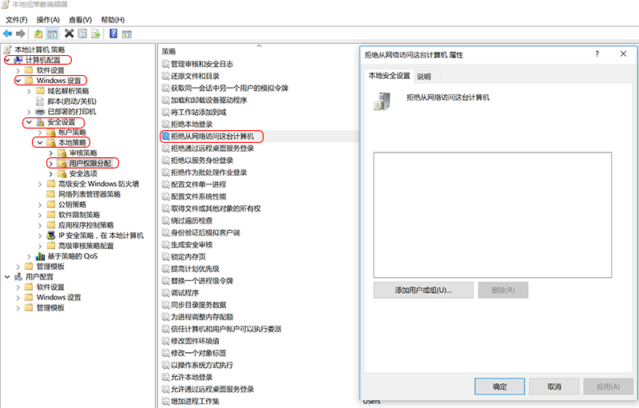
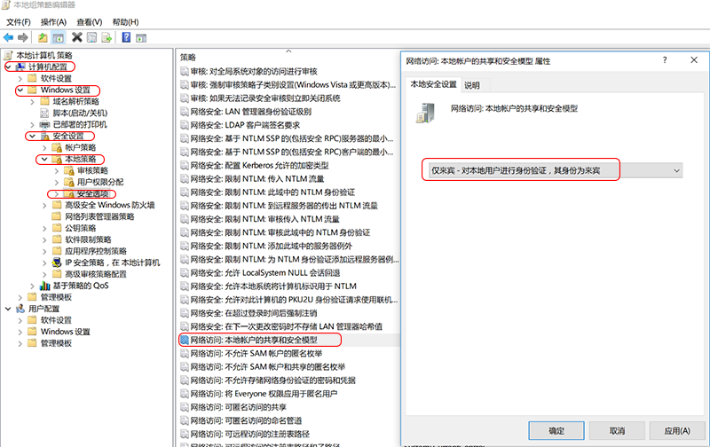
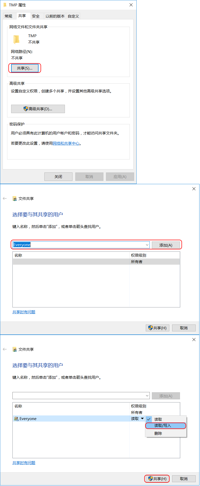
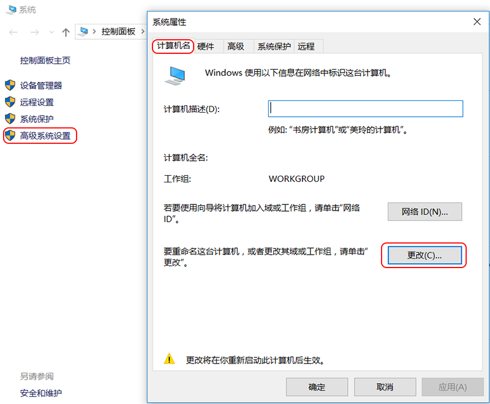

# Windows 共享打开匿名访问权限     
`compmgmt.msc` 打开计算机管理，展开 `用户和组`，点击`用户`，右键点击`Guest`，并点击`属性`，去除`账户已禁用`前面的小勾。          


`gpedit.msc` 运行组策略，\本地计算机\计算机配置\Windows 设置\安全设置\本地策略\用户权限分配，双击`拒绝从网络访问这台计算机`，删除项中的`Guest`账户。         
        

`gpedit.msc` 运行组策略，\本地计算机\计算机配置\Windows 设置\安全设置\本地策略\安全选项，双击`网络访问: 本地账户的共享和安全模型`，设置为`仅来宾`。         
              

共享文件夹，添加`Everyone`账户即可。这样，局域网上其他电脑就可以直接访问在Windows上的共享文件夹了。         
           

`control.exe /name Microsoft.System` 打开系统属性，修改计算机名称，方便远程访问，毕竟名称比IP地址方便记忆。         
                 

### Windows 10 无法访问共享文件          
Windows 10 引入了一个新的安全机制，如果一个网络文件夹是 guest 账号可以访问的，那么 Windows 10 就阻止去访问这个网络文件夹，所以需要使用下面的注册表解决。             
Windows 10 开启 Guest 用户访问共享: [点击查看源文件](../storage/windows/10/open_win10guest.reg)              
```
Windows Registry Editor Version 5.00

[HKEY_LOCAL_MACHINE\SYSTEM\CurrentControlSet\Services\LanmanWorkstation\Parameters]
"AllowInsecureGuestAuth"=dword:00000001
```