# SQL Server 2005 创建定时备份计划失败              
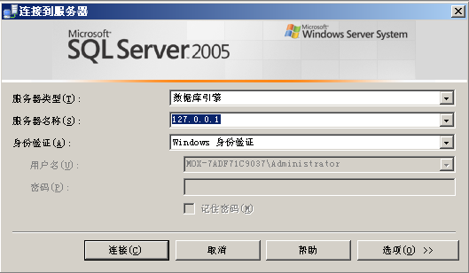                  
故障背景：使用 Windows 身份认证连接 SQL Server 服务器，创建维护计划失败。                   
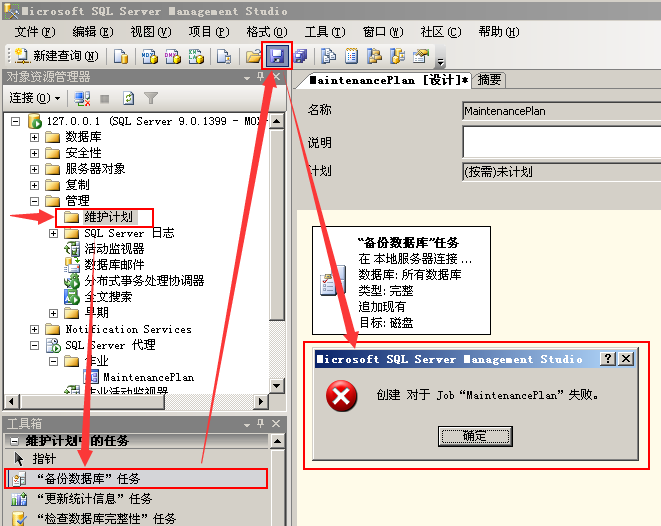                  
网上查询后（觉得可能是msdb数据库文件损坏），获得解决方案一。在虚拟机系统中新装 SQL Server 2005，将 msdb 数据库文件，复制出来，将 SQL Server 停止后，将故障服务器中的文件覆盖掉，并重新启动 SQL Server。            
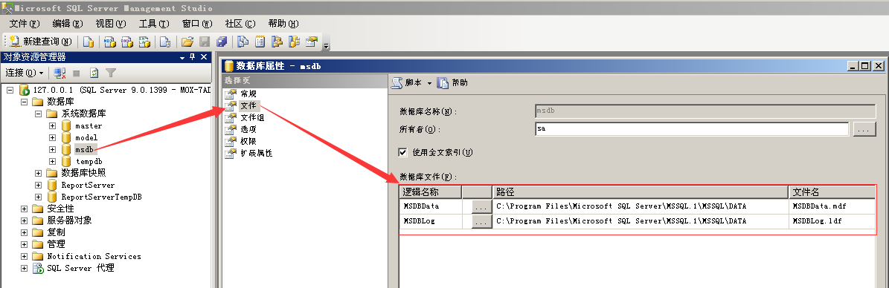                  
操作后，依然提示错误。继续查询（SQL Server 默认必须使用强密码），获得解决方案二。使用带密码的 sa 用户连接 SQL Server 服务器。                
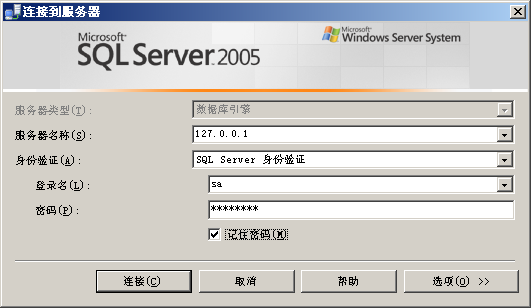                  
创建维护计划             
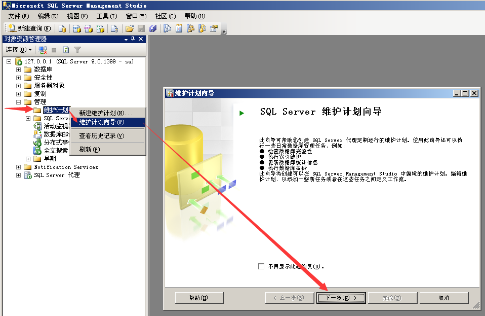                  

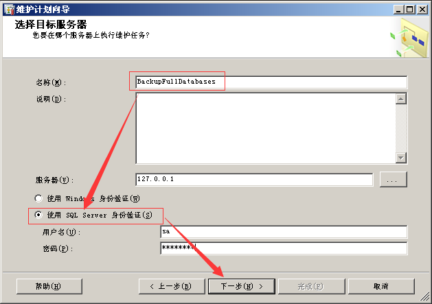                  

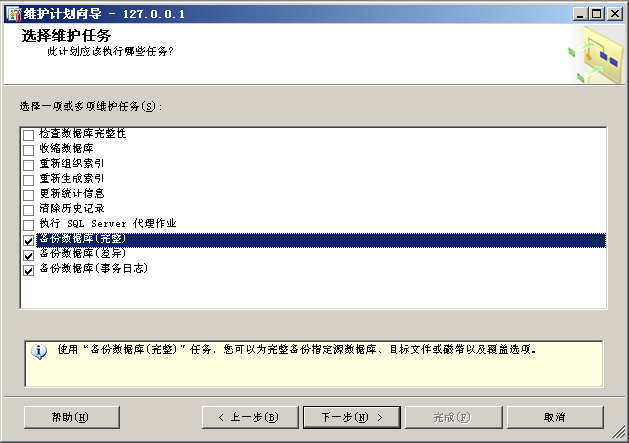                  

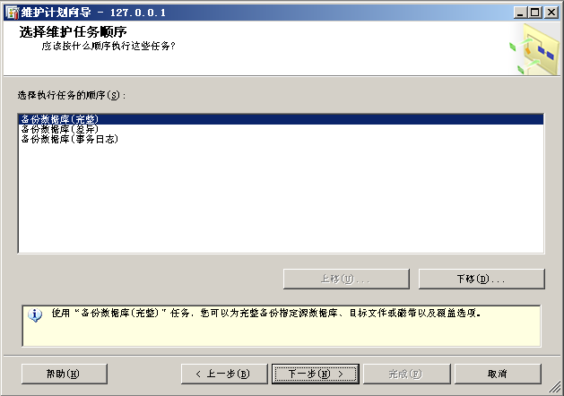                  

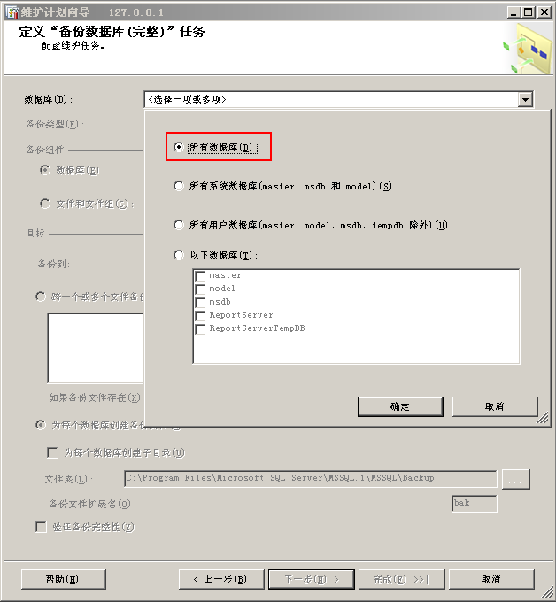                  

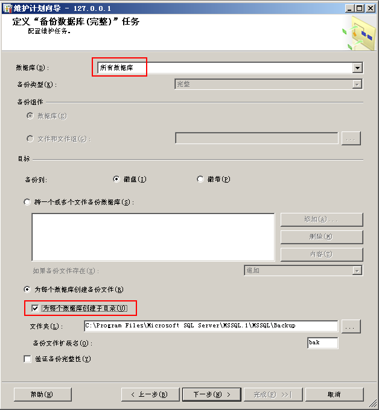                  

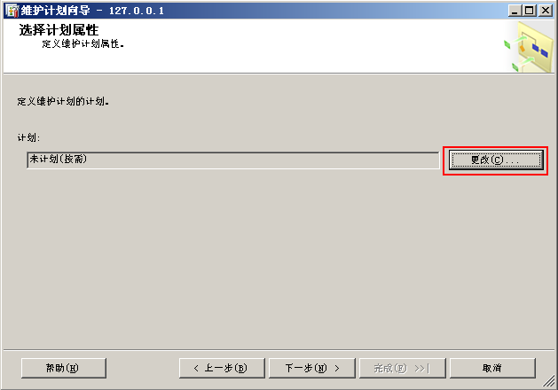                  

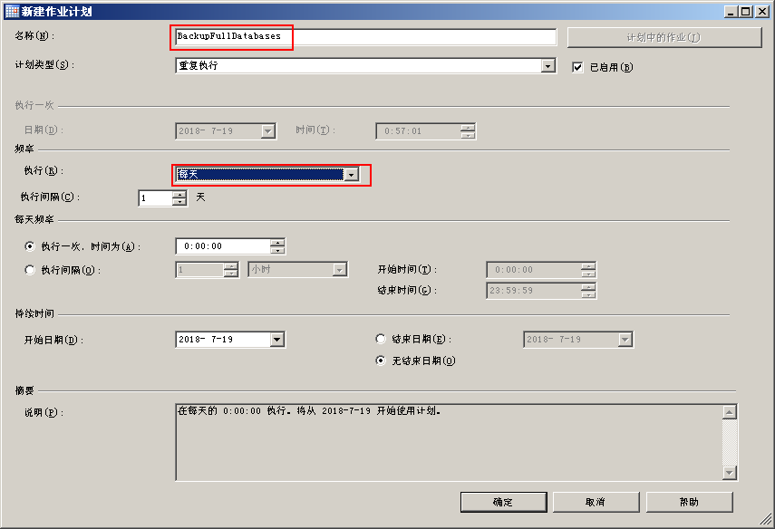                  

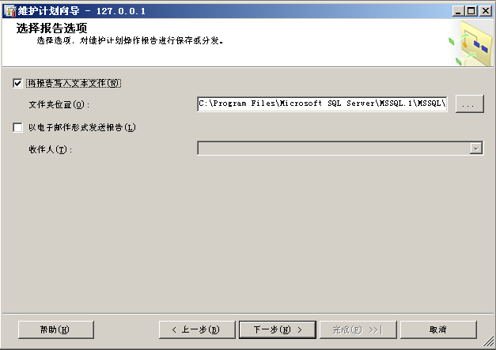                  

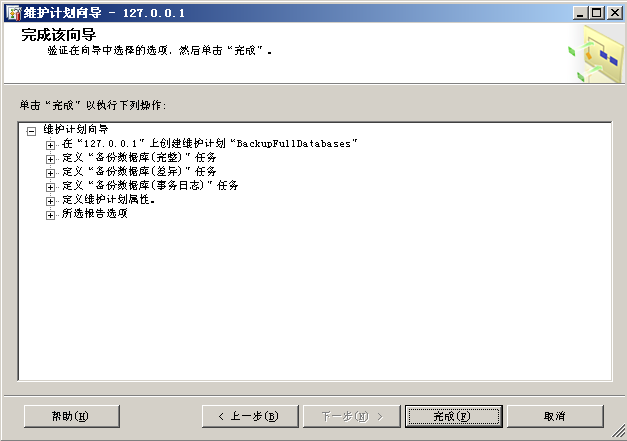                  

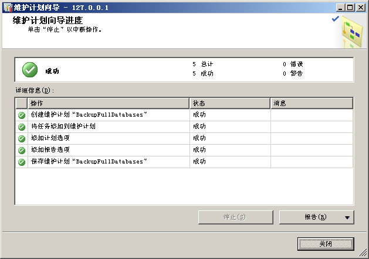                  
维护计划创建完成后，刷新后才能看到创建的维护计划和作业。                
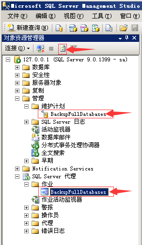                  