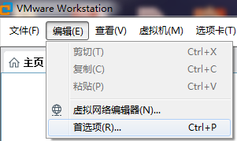
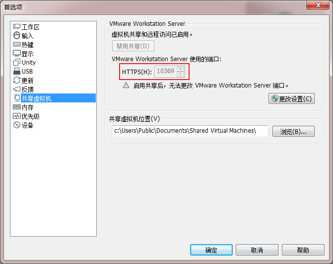
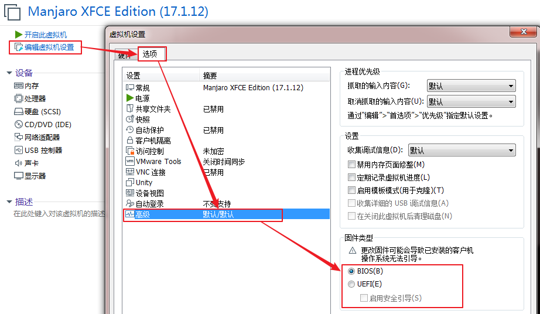
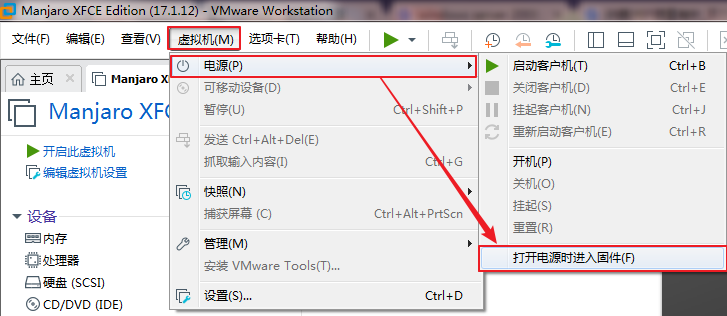
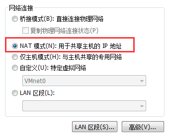
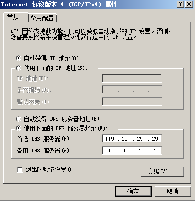

# VMware Workstation              
VMware Workstation Player: [Link](https://www.vmware.com/products/workstation-player/workstation-player-evaluation.html)         
VMware Workstation Pro: [Link](https://www.vmware.com/products/workstation-pro/workstation-pro-evaluation.html)          
VMware tools: [Link](https://packages.vmware.com/tools/releases/)         
VMware-tools-windows: [Link](https://softwareupdate.vmware.com/cds/vmw-desktop/ws)              
VMware-tools-windows-17.5.2: [Link](https://softwareupdate.vmware.com/cds/vmw-desktop/ws/17.5.2/23775571/windows/packages/)      
### 备份 VMware         
备份 VMware 配置文件 `%APPDATA%\VMware\`            
### VMware 默认共享端口，无法启动 web 服务       
VNware 默认共享端口为 443，nginx 、Apache 等web服务应用无法启动。          
        
打开首选项，修改虚拟共享端口为 10369 即可。          
        
### 设置虚拟机固件           
设置虚拟机固件支持 BIOS 或者 UEFI。          
        
进入虚拟机固件设置。           
        
### VMware 主机设置NAT网络，无法上网              
VMware 主机设置 NAT 网络，无法上网。               
        
手动设置虚拟机的 DNS ，网络恢复正常。        
         