# Windows Server 2008 R2 自动登录             
### 组策略设置           
1、打开本地安全策略，使用 `secpol.msc` 打开，或者 `开始`-&gt;`管理工具`-&gt;`本地安全策略`                  
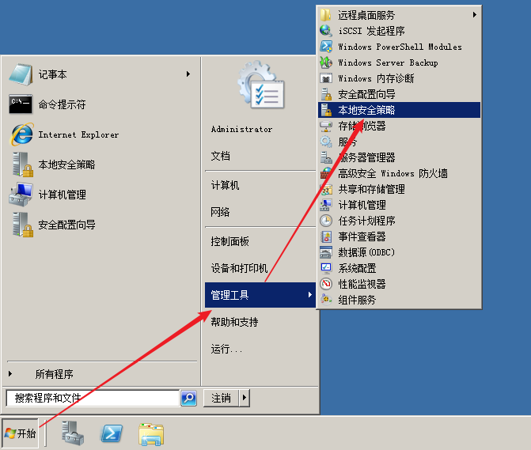            
2、要使用自动登录，就必须使用空密码。禁用密码强度，就可以设置空密码或者简单密码。            
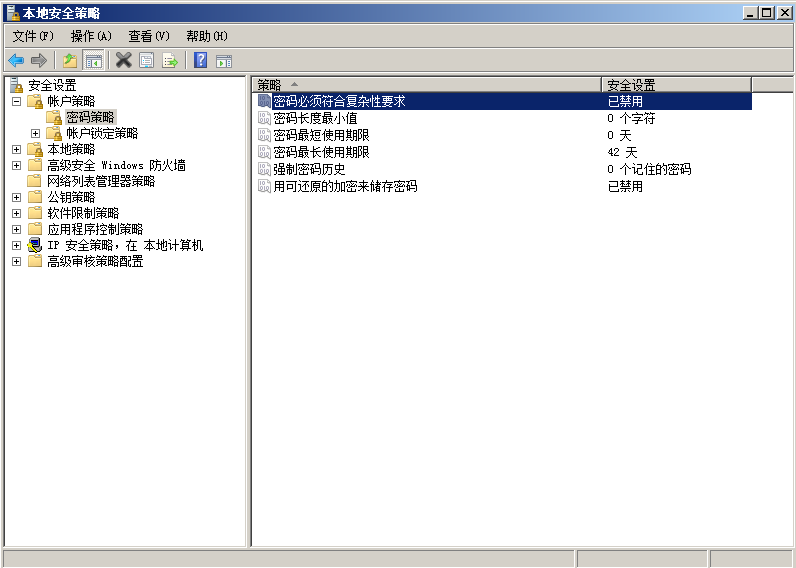            
3、取消 `Ctrl+Alt+Delete` 按键登录，才能实现自动登录。               
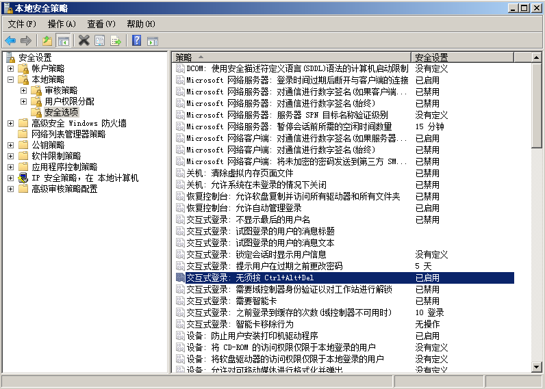            
4、禁用空密码只能登录到控制台，才能实现空密码登录桌面。             
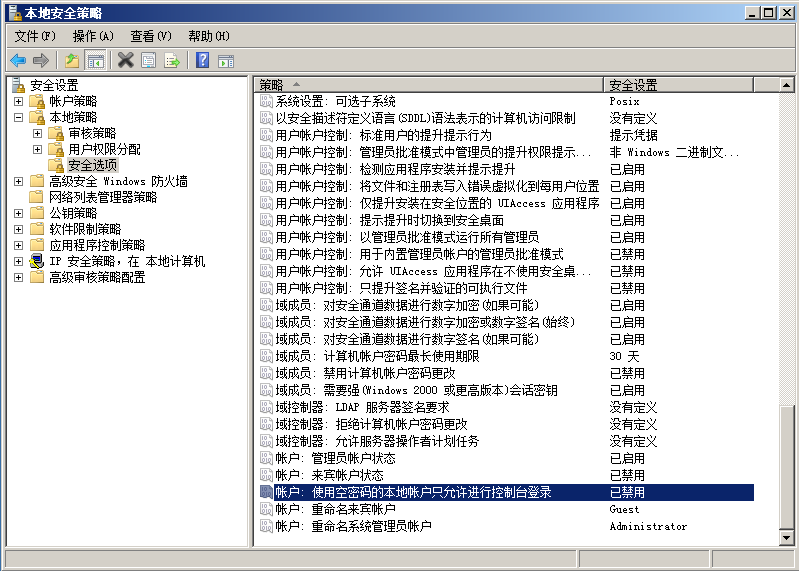            
### 修改密码           
1、打开本地用户和组，使用 `lusrmgr.msc` 打开，或者 `开始`-&gt;`管理工具`-&gt;`计算机管理`             
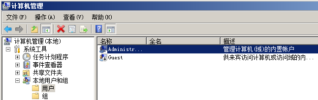            
2、修改 `Administrator` 用户的密码为空密码。           
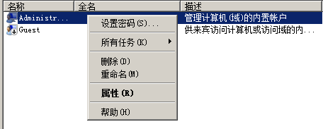            
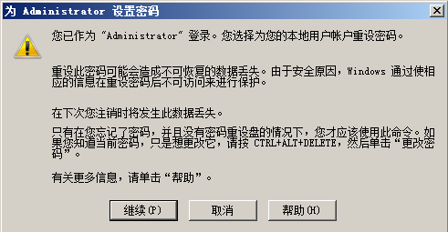            
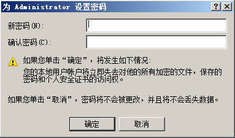            
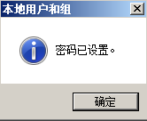            
### 设置自动登录         
1、打开用户账户，使用 `netplwiz` 打开，或者 `rundll32 netplwiz.dll,UsersRunDll` 命令，或者 `control userpasswords2` 命令。            
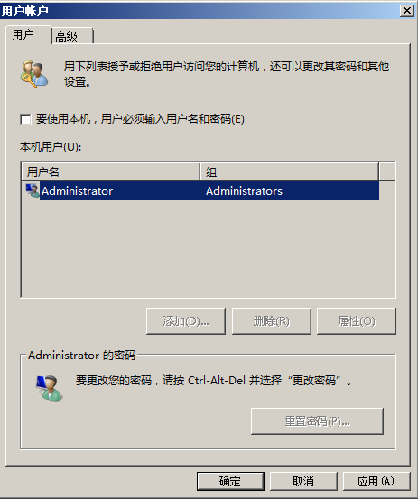           
2、去掉 `要使用本机，用户必须输入用户名和密码` 选框勾选，点击 `应用` 按钮。           
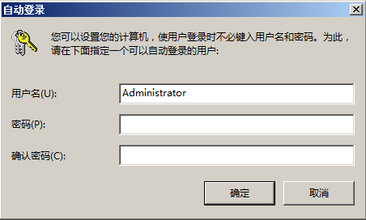      
3、点击 `确定` ，就设置好了自动登录。          