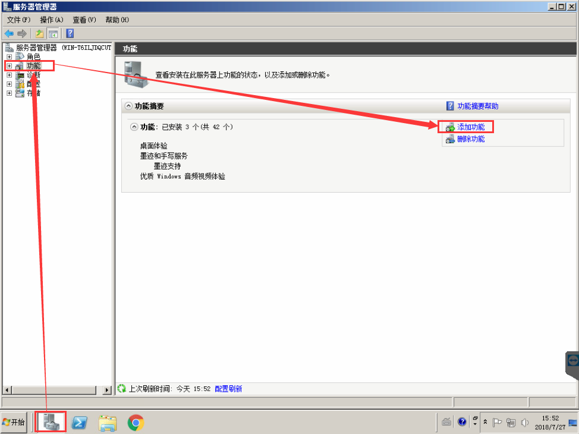
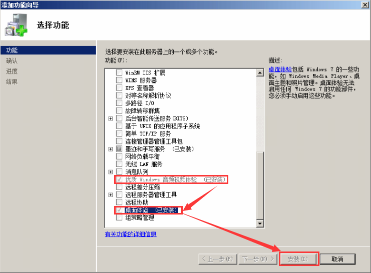

# Windows Server 2008 R2 64位 喇叭有红叉提示未安装任何音频输出设备               
背景：原来的系统是 Windows 10 64位 企业版，当服务器用经常死机，就把系统重装位 Windows Server 2008 R2 64位 企业版，所有的驱动全部安装好，右下角喇叭有红叉提示`“未安装任何音频输出设备”`。使用驱动精灵，更换了多个驱动错误依旧。            

一、服务中开启 `Windows Audio` 和 `Windows Audio Endpoint Builder` 的自动启动。            
        
二、打开`服务器管理器`，`功能`，`添加功能`。`优质 Windows 音频视频体验` 和 `桌面体验`。          
        
        
三、使用远程桌面连接服务器，发现还是提示 `“未安装任何音频输出设备”`,使用 `Teamviewer` 远程就没有这个问题了。         
